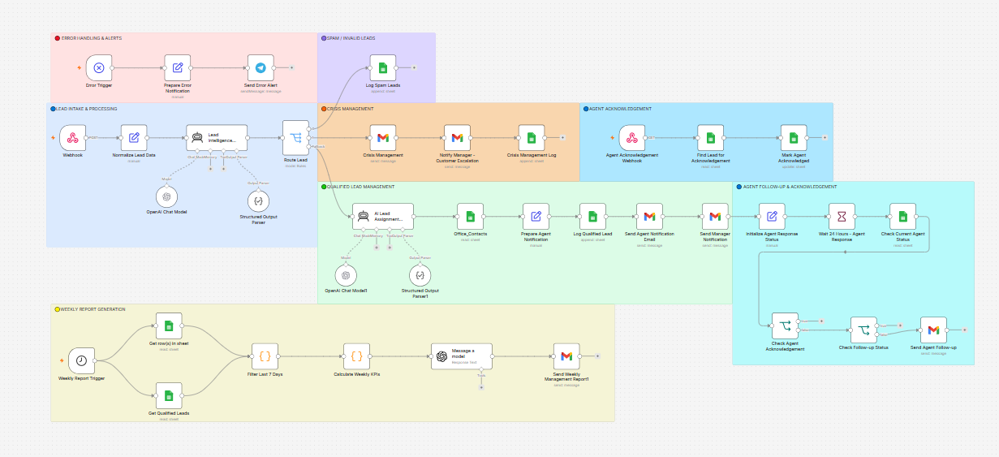

# 🏡 AI Real Estate Lead Management & Automation

**An AI-powered n8n automation system for managing, analyzing, assigning, and monitoring real estate leads across multiple offices.**

Real estate agencies receive leads from different channels and need to respond quickly, assign them to the right office or agent, identify high-value opportunities, and handle urgent or negative situations before they become lost opportunities.

This workflow automates the entire lead management process—from **lead intake and AI analysis to assignment, follow-up, crisis escalation, and management reporting.**

---

## 🎯 The Problem

Managing real estate leads manually can create several problems:

* Leads may be assigned to the wrong office or agent
* High-value leads can be overlooked
* Negative or frustrated customers may not be identified quickly
* Agents may forget to acknowledge newly assigned leads
* Managers may not be notified when an urgent situation occurs
* Follow-ups can become inconsistent
* Management lacks a centralized overview of lead activity

As the number of leads increases, these manual processes become difficult to manage and scale.

---

## ✅ The Solution

This n8n-based automation analyzes every incoming lead using AI and automatically determines how the lead should be handled.

The system can:

* Analyze lead information using AI
* Detect customer sentiment
* Rate lead quality and priority
* Generate recommendations for the assigned team
* Automatically assign leads to approved offices
* Notify the responsible representative
* Track agent acknowledgement
* Send a reminder if the lead is not acknowledged within 24 hours
* Detect crisis or complaint situations
* Escalate critical cases to management
* Notify both representatives and managers when required
* Generate weekly management reports
* Handle workflow errors and send error notifications

The goal is to reduce manual work while making sure important leads and critical situations are not missed.

---

# ⚙️ Workflow Overview

```text
                    New Lead
                       │
                       ▼
                 Webhook Trigger
                       │
                       ▼
              Lead Data Processing
                       │
                       ▼
                AI Lead Analysis
                       │
          ┌────────────┼────────────┐
          ▼            ▼            ▼
      Sentiment      Lead Score   Recommendation
          │            │            │
          └────────────┼────────────┘
                       ▼
               Lead Assignment AI
                       │
                       ▼
              Approved Office
                       │
              ┌────────┴────────┐
              ▼                 ▼
       Normal Lead          Crisis / Complaint
              │                 │
              ▼                 ▼
     Representative       Crisis Management
       Notification              │
              │           ┌───────┴───────┐
              ▼           ▼               ▼
      24h Acknowledgement Manager      Representative
              │          Notification    Notification
       ┌──────┴──────┐
       ▼             ▼
   Acknowledged   No Response
       │             │
       │             ▼
       │       24h Reminder
       │
       ▼
   Lead Follow-up

                       │
                       ▼
                Weekly Report
                       │
                       ▼
                  Management
```

---

# 🧠 AI Lead Analysis

The workflow uses AI to analyze incoming lead information and extract useful business insights.

The analysis can include:

### Sentiment Analysis

The system evaluates the customer's communication and identifies the general sentiment of the lead.

Examples:

* Positive
* Neutral
* Negative
* Urgent / frustrated

This helps the team prioritize leads that may require immediate attention.

### Lead Rating

Each lead can be evaluated based on the available information and assigned a priority or quality level.

This allows the team to distinguish between:

* High-priority opportunities
* Normal leads
* Low-priority leads
* Potentially problematic cases

### AI Recommendation

The AI also generates a recommendation based on the lead information.

This gives the representative additional context before contacting the customer.

---

# 🤖 AI Lead Assignment

After analyzing the lead, the system automatically determines the appropriate office.

The AI is restricted to a predefined list of **approved offices**, preventing it from inventing or assigning leads to unauthorized locations.

Example approved offices include:

```text
AUS-DOWNTOWN
AUS-NORTH
AUS-SOUTH
DAL-DOWNTOWN
DAL-NORTH
FTW
HOU-CENTRAL
HOU-WEST
SAT-CENTRAL
```

The assignment process returns:

* Assigned office
* Reason for the assignment

This makes the assignment process more consistent and transparent.

---

# 📧 Automated Representative Notification

After a lead is assigned, the responsible representative receives an automated email containing the relevant lead information.

The notification can include:

* Lead information
* Lead summary
* Sentiment
* Lead rating
* AI recommendation
* Assigned office
* Acknowledgement link

This removes the need for manual notification and reduces response time.

---

# ⏱️ 24-Hour Agent Acknowledgement

The system tracks whether the assigned representative has acknowledged the lead.

A dedicated **24-hour acknowledgement webhook** allows the representative to confirm that the lead has been received.

### If the representative acknowledges:

The workflow records the acknowledgement and stops the reminder process.

### If the representative does not acknowledge:

After 24 hours, the system automatically sends a reminder.

This prevents leads from silently remaining unattended.

The workflow is also designed to avoid repeatedly sending the same reminder.

---

# 🚨 Crisis & Complaint Management

One of the most important parts of the automation is the separate crisis-management path.

When the AI identifies a potentially critical situation, the workflow routes the lead into a dedicated crisis process instead of treating it like a normal lead.

Examples can include:

* Strongly negative sentiment
* Customer complaints
* Escalation requests
* Urgent situations
* Potential service failures

Instead of waiting for the normal follow-up process, the system can immediately escalate the situation.

---

# 👔 Management Escalation

When a crisis or critical case is detected, management can be notified automatically.

The system can send the relevant information to the manager while also notifying the responsible representative when appropriate.

This gives management visibility into critical cases without requiring staff to manually report every incident.

The goal is simple:

**Critical situations should reach management before they become bigger problems.**

---

# 📊 Weekly Management Report

The workflow also generates a **weekly lead management report**.

The report provides management with an overview of lead activity and workflow performance.

It can summarize information such as:

* Total leads
* Lead distribution
* Lead ratings
* Sentiment patterns
* Assigned offices
* Follow-up activity
* Acknowledgement status
* Crisis / complaint cases
* Overall lead activity

This gives management a higher-level view instead of requiring them to inspect individual leads manually.

---

# 🛡️ Error Handling

The automation includes dedicated error-handling logic to make the workflow more reliable.

Instead of allowing an error to silently stop the process, failures can be detected and routed through an error-handling workflow.

This architecture helps with:

* Workflow failure detection
* Error notifications
* Debugging
* Monitoring
* Safer automation execution

The error-handling architecture is separated from the main business logic to keep the workflow easier to maintain.

---

# 🧩 Modular Workflow Architecture

The project is designed using modular n8n workflows and sub-workflows.

Instead of putting every operation into one large workflow, different responsibilities can be separated into dedicated components.

This makes the system:

* Easier to understand
* Easier to debug
* Easier to modify
* Easier to extend
* More suitable for production-oriented automation

New channels, business rules, notification methods, or reporting features can be added without rebuilding the entire system.

---

# 📸 Workflow Overview



---

# 🎥 Workflow Demo

The complete workflow demonstration is included in the repository.

**Demo:** [`Version1.mp4`](demo/Version1.mp4)

The video demonstrates the main automation flow and its key components.

---

# 🚀 Key Features

* ✅ AI-powered lead analysis
* ✅ Sentiment analysis
* ✅ Lead rating and prioritization
* ✅ AI-generated recommendations
* ✅ Multi-office lead assignment
* ✅ Restricted approved-office selection
* ✅ Automated representative email notifications
* ✅ 24-hour acknowledgement system
* ✅ Dedicated acknowledgement webhook
* ✅ Automatic 24-hour reminder
* ✅ Crisis and complaint detection
* ✅ Crisis management workflow
* ✅ Manager escalation
* ✅ Representative + manager notifications
* ✅ Weekly management reports
* ✅ Error-handling workflow
* ✅ Modular n8n architecture
* ✅ Conditional routing
* ✅ Automated follow-up logic

---

# 💼 Business Value

### Without Automation

❌ Leads require manual processing
❌ Representatives may miss new assignments
❌ High-priority leads can be overlooked
❌ Customer complaints may not reach management quickly
❌ Follow-ups depend on manual tracking
❌ Managers have limited visibility into lead activity
❌ Weekly reporting requires manual work

### With This Automation

✅ Leads are automatically analyzed and routed
✅ Important leads can be prioritized
✅ Representatives receive automated notifications
✅ Unacknowledged leads trigger follow-up
✅ Critical cases are escalated automatically
✅ Management receives structured reports
✅ Errors can be detected and handled
✅ The process scales more easily as lead volume grows

---

# 🛠️ Tech Stack

* **n8n** — Workflow automation
* **OpenAI / LLM** — AI lead analysis and decision-making
* **Webhooks** — Lead intake and acknowledgement
* **Google Sheets** — Lead data storage and updates
* **Email Automation** — Representative and management notifications
* **JSON** — Structured data processing
* **Conditional Routing** — Business logic and workflow decisions
* **Sub-workflows** — Modular architecture
* **Error Handling** — Workflow monitoring and recovery

---

# 🧠 What This Project Demonstrates

This project demonstrates how AI and workflow automation can be combined to solve a real business process rather than simply automate individual tasks.

It covers several important automation concepts:

* AI agents and structured AI outputs
* Business-rule enforcement
* Lead classification
* Automated decision-making
* Multi-path workflow architecture
* Webhook-based interactions
* Human-in-the-loop workflows
* Automated escalation
* Error handling
* Scheduled reporting
* Modular workflow design

---

# 🔮 Future Improvements

Possible future improvements include:

* Multi-channel lead intake
* CRM integration
* Real-time management dashboard
* Historical lead analytics
* Advanced lead scoring
* Automated SMS / WhatsApp notifications
* More advanced sentiment classification
* SLA monitoring
* Automated performance dashboards
* Multi-region expansion

---

# 👨‍💻 Author

**Hossein Sepiyani**

Automation Developer specializing in AI-powered workflows and business process automation.

🔗 GitHub:
https://github.com/hosseinsepiyani

🔗 LinkedIn:
https://linkedin.com/in/hosseinsepiyani

---

⭐ **If you found this project useful, consider giving it a Star.**
